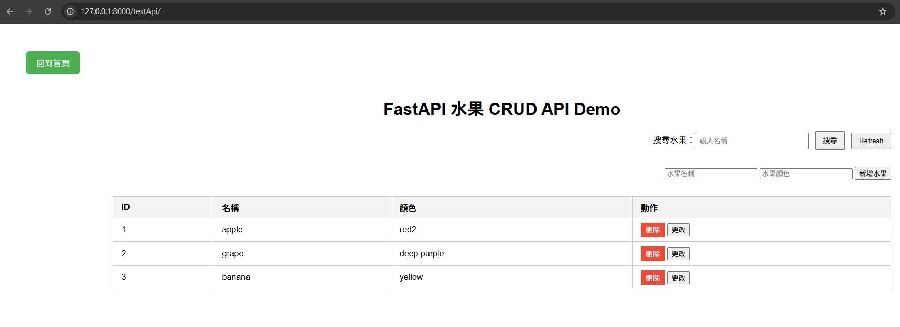
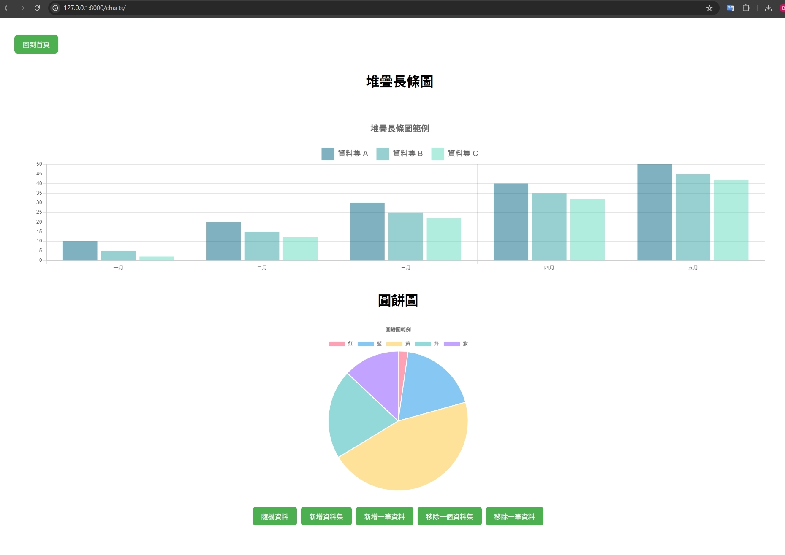
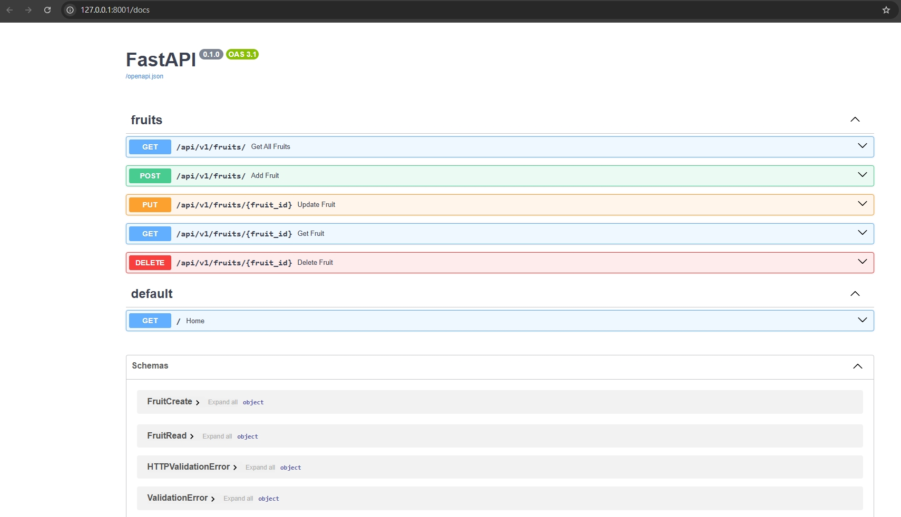

# Django + FastAPI Demo
結合 Django (管理介面) + FastAPI (API服務) + Chart.js (前端圖表)，完整的小型專案展示！

## 🛠 使用技術
- Django 網站入口與管理）
- FastAPI （RESTful API服務）
- SQLite3（資料庫）
- SQLAlchemy 2.0.40（FastAPI ORM）
- Chart.js（CDN前端動態圖表）
- Uvicorn 0.34.2（ASGI伺服器）

## 🚀 專案功能
- Django 作為主網站入口與管理介面
- FastAPI 提供 RESTful API，CRUD 展示
- Chart.js 圖表展示
- SQLite 資料庫連接與操作
- 整合Swagger API文件

## 📦 啟動方式

```bash
# 建立虛擬環境
python -m venv .venv
source .venv/Scripts/activate

# 安裝套件
pip install -r requirements.txt

# 啟動Django伺服器
python manage.py runserver

# (另開一個Terminal) 啟動FastAPI
start_api.bat
```

Django 網站：http://127.0.0.1:8000

FastAPI API：http://127.0.0.1:8001/docs

## 🎯 成果畫面

### 首頁功能選單


### 動態圖表展示


### API Swagger文件
